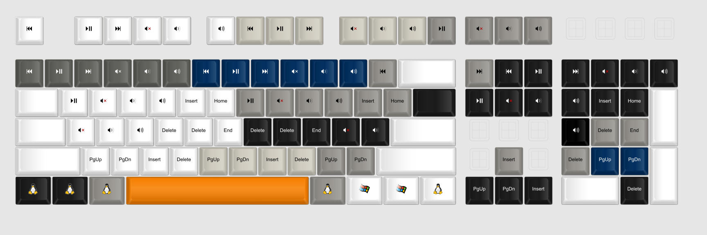
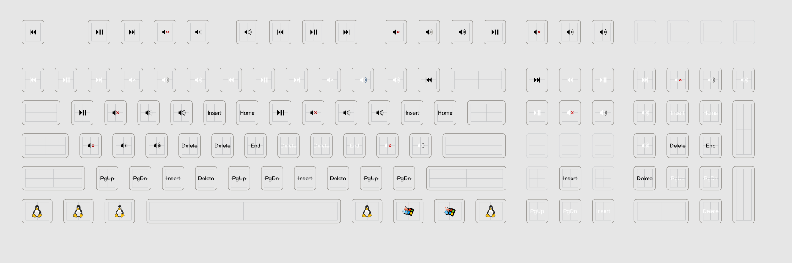

# Staehle's Multimedia Keycaps as SVG for WASD Custom Printing

Custom order for various fill-ins for keycap sets that are missing certain media keys or are missing certain navigation keys in certain row profiles:
 * Play/Pause
 * Next Track
 * Previous Track
 * Volume Up
 * Volume Down
 * Mute
 * Insert
 * Home
 * Page Up
 * Delete
 * End
 * Page Down

Also since this was for a [WASD 104-key order](https://www.wasdkeyboards.com/104-key-custom-cherry-mx-keycap-set.html), various 1.5+u blanks and Linux / Tux and Windows 95 / 98 1.25u OS modifier keys. (Love the old-school Win-key aesthetic.)

## Render Preview:

## Key List:

Total list of custom keys and their corresponding keycap base colors:
 * R1 (Cherry profile R0 and R1 are the same) (Top row, WASD calls this R4)
   * 36 1u keys
     * 6x Full Multimedia Set (6 keys: Play/Pause, Next, Prev, Vol+, Vol-, Mute) in White, Beige, Slate, Graphite, Navy Blue, and Black.
   * 1 2u key (Backspace)
     * Blank white
 * R2 (WASD calls this R3)
   * 18 1u keys
     * 3x Vol+, Vol-, Mute, Play/Pause, Insert, and Home Sets in White, Slate, and Black
   * 2 1.5u keys (Tab, Pipe)
     * Blanks in White and Black
 * R3 (WASD calls this R2)
   * 11 1u
     * 2x Vol+, Vol-, Mute, Delete, and End Sets in White and Black
     * 1x End in Slate (completes R2 Home)
   * 2 1u w/ Homing Line (F, J)
     * 2x Delete in White and Black (Thought it would be interesting to have a Del key with a homing bump)
   * 1 1u w/ Homing Dot (Num 5)
     * 1x Delete in Slate (completes R2 Insert)
   * 1 1.75u (Caps)
     * Blank white
   * 1 2.25u (Enter)
     * Blank white
   * 1 2x1u (Num +)
     * Blank white
 * R4 (Cherry profile R4 and R5 are the same) (Bottom row, WASD calls this R1)
   * 18 1u keys
     * 4x PgUp, PgDn, Insert, Delete sets in White, Beige, Slate, and Black
     * 1x PgUp, PgDn in Navy Blue
   * 7 1.25u (Modifiers/OS)
     * 5x Linux Tux keys in 2 Black, 2 Beige, and 1 White. (Black Tux have 50% Gray outline)
     * 2x Windows 95 / 98 logo keys in White
   * 1 2u (Num 0)
     * Blank white
   * 1 2.25u (Left Shift)
     * Blank white
   * 1 2.75u (Right Shift)
     * Blank white
   * 1 2x1u (Num Enter)
     * Blank white
   * 1 6.25u Spacebar
     * Blank orange
   

## SVG:

For those doing searches for something like this, hopefully there were enough keywords in here for you to find this. Hope this helps!

